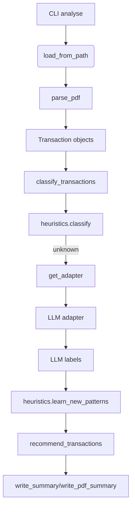

# Module Guide

This document summarises the purpose of each Python module in the project and illustrates how they interact.

## Package Structure

- **bankcleanr/** – main library package
  - `cli.py` – Typer-based command line interface for analysing statements.
  - `analytics.py` – helper functions calculating savings totals.
  - `io/` – PDF parsing utilities and loaders.
  - `llm/` – language model adapters and helper functions.
  - `recommendation.py` – generates cancellation recommendations.
  - `reports/` – writers for CSV/PDF/terminal summaries.
  - `rules/` – regex heuristics and prompt templates.
  - `transaction.py` – dataclass representing a bank transaction.
  - `settings.py` – loads configuration from `~/.bankcleanr/config.yml`.
  - `gui/` – placeholder for a future graphical interface.
  - `__main__.py` – entry point so the package can be executed with `python -m bankcleanr`.

## Module Responsibilities

### `cli`
Implements the `bankcleanr` command with subcommands:
- `analyse` – parse statement PDFs, classify transactions and write reports.
- `config` – display the settings file in use.
- `gui` – stub for a graphical interface.
The CLI uses functions from `io.loader`, `llm`, `recommendation` and `reports.writer`.

### `analytics`
Provides pure functions to summarise recommendations:
- `calculate_savings` sums cancelable amounts.
- `totals_by_type` aggregates spending by category.
- `summarize_by_description` groups transactions by description.

### `io.loader`
Dispatches to the appropriate parser based on file extension and can handle entire directories of PDFs. Uses `io.pdf.generic` for PDF parsing.

### `io.pdf.*`
- `generic` – parses generic bank statements using `pdfplumber` with regex fallbacks and optional OCR via `ocr_fallback`.
- `barclays` / `lloyds` – thin wrappers that currently delegate to `generic`.
- `ocr_fallback` – uses Tesseract OCR when text extraction fails.

### `llm`
Defines adapters for different language model providers (`openai`, `anthropic`, `mistral`, `gemini`, `bfl`, `local_ollama`). `classify_transactions` combines local heuristics with an adapter to label transactions. `utils.probe_adapter` performs a health check for live adapters.

### `recommendation`
Loads a cancellation knowledge base and turns labelled transactions into `Recommendation` objects with actions such as “Cancel” or “Investigate”.

### `reports.writer`
Outputs summaries in CSV, terminal text or PDF format. PDF reports include transaction tables, a “How to cancel” appendix, summary figures and the global disclaimer from `reports.disclaimers`.

### `rules`
- `regex` – loads and matches regex patterns for local classification.
- `heuristics` – high level logic for applying and learning new patterns.
- `prompts` – Jinja templates used by LLM adapters.

### `transaction`
Defines the `Transaction` dataclass and utilities for masking account and sort code details before sending text to LLM services.

### `settings`
Reads configuration, combines it with environment variables and exposes a `Settings` dataclass.

## Flowchart

The CLI orchestrates the workflow: it loads transactions from PDFs, classifies them using heuristics and (optionally) an LLM adapter, updates regex rules, converts labels into recommendations, and finally writes CSV/PDF/terminal reports.

